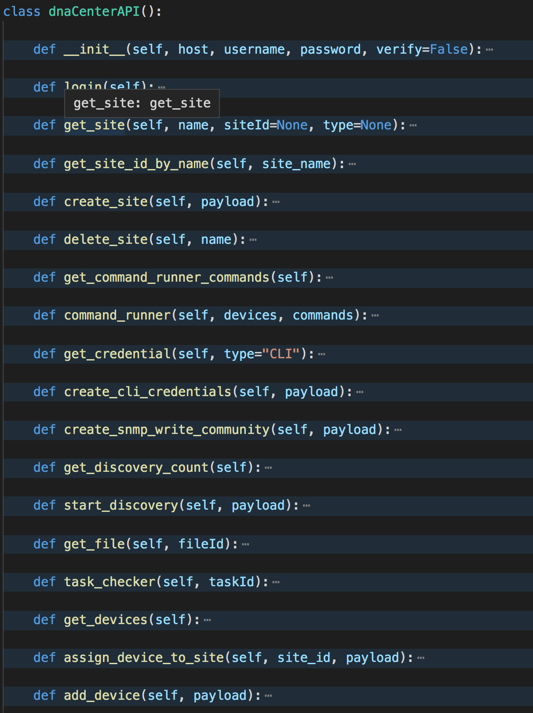

# ENAUTO DNA Center Demo

The purpose of this repository is to provide a starting point for your exploration into the DNA Center APIs.  Postman is a great way to get familiar with APIs in general, but in this demo we will focus on using Python and the `requests` library.  Please feel free to explore using any additional means.

## Reference Class
The `cisco_dnacenter` folder in this repository is a git submodule that points to a repository I biuld as I studied for the ENAUTO test.  You can use this as reference for building your own helper functions.

## Cloning the Repo

`git clone --recurse-submodules https://github.com/jandiorio/enauto-dnacenter-demo.git`

## Documentation
The first step in learning any API is figuring out where to find the documntation.  The DNA Center APIs can be found on-box by navigating to **Platform**->**Developer Toolkit**->**APIs**.

**Example:** https://{{your_dna_center}}/dna/platform/app/consumer-portal/developer-toolkit/apis

The second place to find documentation about the DNA Center APIs is the DevNet Website. Navigate to https://developer.cisco.com -> **Technologies** -> **Networking** -> **Cisco DNA Center Platform**.

There is a lot of great information about APIs on this site.  Here is a direct link [DNA Center APIs on DevNet](https://developer.cisco.com/docs/dna-center/#!cisco-dna-center-platform-overview/intent-apis)

It's a good idea to read through the API documenation.

## The API Wrapper

There is already an SDK for DNA Center that was developed by Cisco, but in the interest of learning, I have created my own API wrapper that encapsulates only the API endpoints that we will use.

Below is a screenshot of the methods that have been created to drive the capabilities of this learning demo for working with the DNA Center APIs.

## Authentication
The first step when working with any new API is figuring out how we will authenticate (if authentication is required).

Cisco DNA Center uses a combination of HTTP Basic Auth and a Token.

The `1_login.py` imports this API wrapper using this `import cisco_dnacenter.dnac.dnac_api as dnac_api`.

This script is also using an library named `python-dotenv` to load environment variables based on the content in the .env file.  This allows you to keep your credentials in a local file that is excluded from your remote repositories (using .gitignore).

### Execute the Script

To execute this python script use the following command:

`python 1_login.py`

The method in the API wrapper will update the python request.session object with the headers that include the **X-Auth-Token** value.

## Site

## Discovery

## network-devices

## Resources

